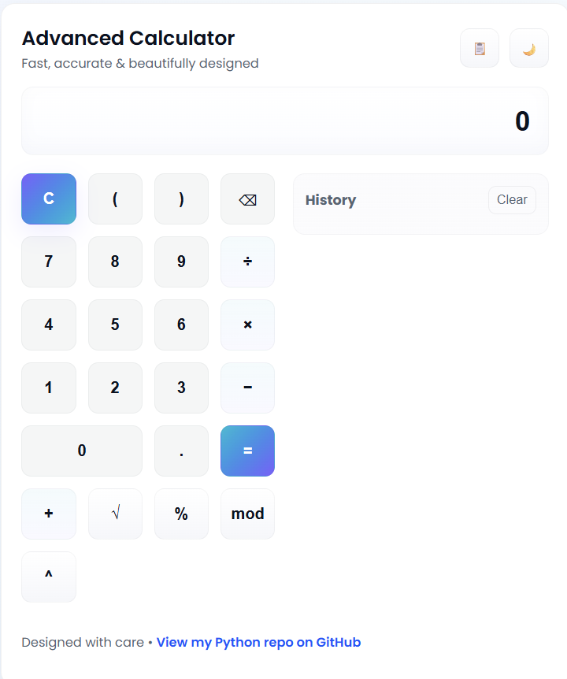

# Advanced Calculator

This project is a fully interactive calculator I designed and developed to demonstrate my skills in Applied Computer Science.

### Features
- Basic operations: +, -, *, /
- Advanced functions: square root, percentage, power, modulus
- Clean, responsive user interface
- Day / Night mode toggle
- History with per-entry delete and clear-all
- Live version available online

### Live Demo
[Try it here](https://ash-933.github.io/Advanced-Calculator/)  <!-- update if your published URL differs -->

### Tech
- HTML, CSS, JavaScript
- math.js for safe expression evaluation

### How to run locally
1. Clone the repo:
   ```
   git clone https://github.com/Ash-933/Advanced-Calculator.git
   cd Advanced-Calculator
   ```
2. Open `index.html` in your browser OR run a simple server:
   ```
   python -m http.server 8000
   # then open http://localhost:8000
   ```

### Notes
- Add `screenshot.png` to the repo root if you want a visual preview in the README:
  ```
  
  ```
- History is stored in the browser (localStorage) and will persist until cleared.

### Author
Ash-933 — https://github.com/Ash-933

### License
MIT

